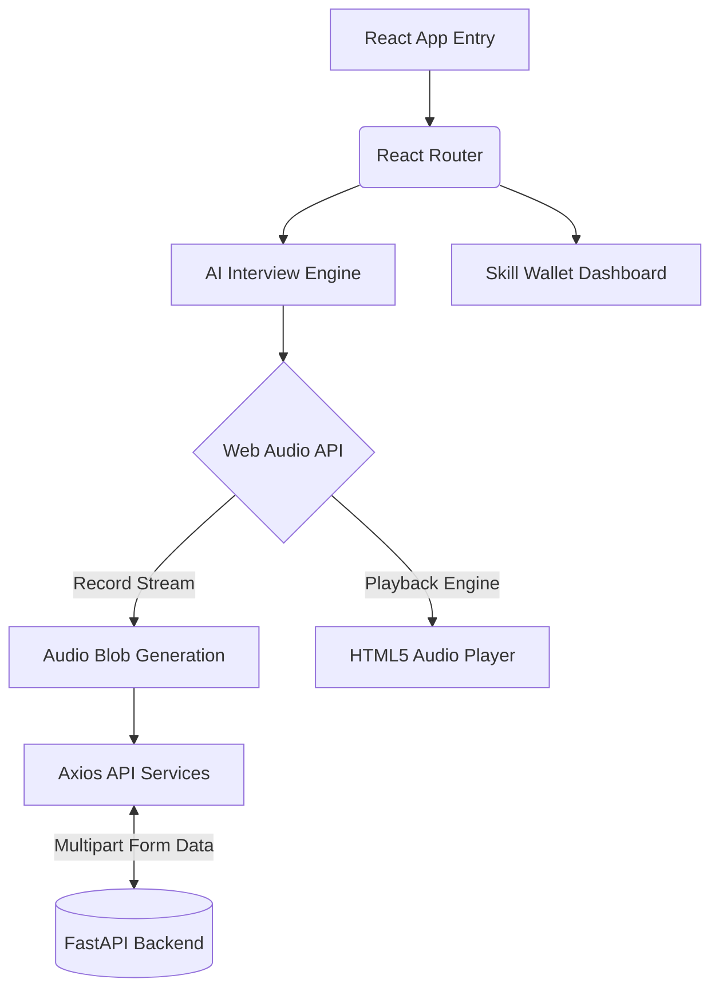
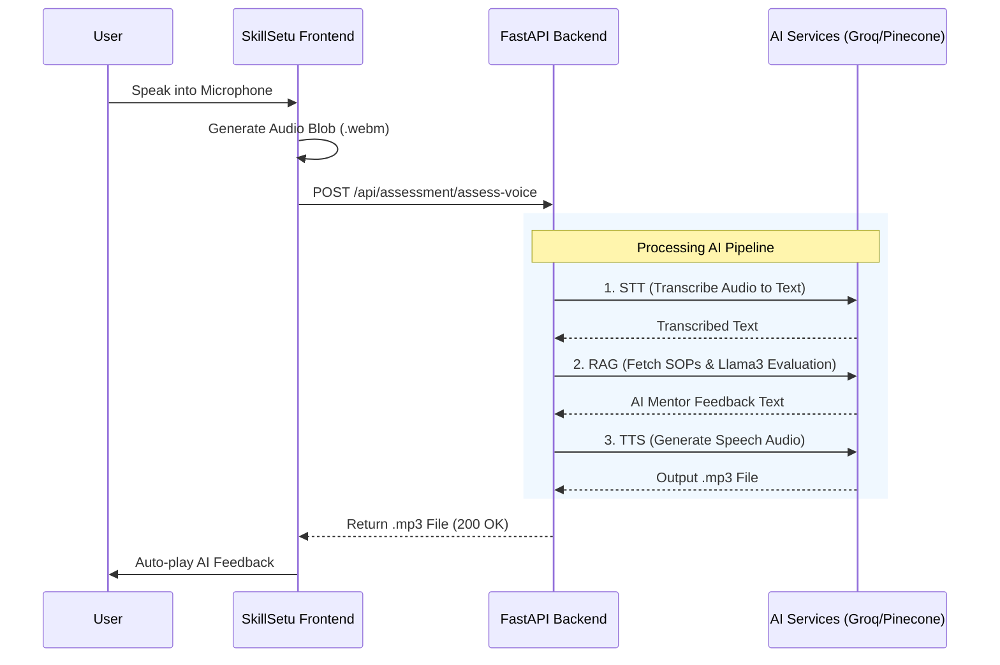

# SkillSetu – Frontend Application

SkillSetu is a **next-generation vocational training and assessment platform** designed to empower blue-collar workers through AI-driven skill evaluation and personalized learning insights.

This repository contains the **frontend client**, built to deliver a fast, responsive, and accessible user experience. The application supports **real-time AI voice interviews, skill tracking dashboards, and seamless backend integration** for intelligent assessment workflows.

---

# Overview

The SkillSetu frontend focuses on providing a **high-performance and intuitive user interface** optimized for accessibility and mobile-first usage. It enables users to participate in **AI-powered voice interviews**, visualize their **skill development through dashboards**, and receive **instant AI-generated feedback**.

Key technical capabilities include:

- Real-time **audio recording and playback**
- Efficient **Speech-to-Text (STT) blob generation**
- **Responsive UI components** optimized for low-end devices
- Seamless **API communication with FastAPI backend services**

---

# Tech Stack

| Category | Technology |
|--------|-------------|
| Framework | React + Vite |
| Styling | Tailwind CSS |
| Routing | React Router DOM |
| Audio Processing | Native Web Audio API / HTML5 Audio |
| HTTP Client | Axios |
| Build Tool | Vite |

---

# Key Features

## AI Voice Interview Interface
- Real-time audio recording using Web Audio APIs  
- Automatic audio blob generation for AI processing  
- Integrated playback for response verification  

## Skill Wallet & Heatmap Dashboard
- Visual representation of user skill levels  
- Interactive heatmaps to track skill progression  
- Data-driven insights for training improvement  

## Mobile-First Responsive Design
- Optimized layouts for smartphones and low-bandwidth environments  
- Accessible UI components for diverse user groups  

## Seamless Backend Integration
- Communication with **FastAPI-based AI services**
- Optimized API calls for low latency responses
- Scalable architecture for future AI enhancements

---

# Architecture & Data Flow

## Frontend Client Architecture

The frontend is built on a component-driven architecture, utilizing modern browser APIs to handle complex media streams before securely passing payloads to the backend.



## AI Assessment API Loop

This sequence illustrates the complete data lifecycle during a real-time vocational voice assessment.



---

# Project Structure

```bash
src/
├── assets/          # Static images, icons, and global styles
├── components/      # Reusable UI components (Buttons, Chat bubbles, Audio players)
├── pages/           # Full page views (AIInterview, Dashboard, etc.)
├── services/        # API call wrappers and Axios configurations
├── App.jsx          # Application routing configuration
└── main.jsx         # React entry point
```

---

# Prerequisites

Before running the project, ensure the following dependencies are installed:

- **Node.js (v16 or higher recommended)**
- **npm** or **yarn**

Download Node.js:  
https://nodejs.org/

---

# Installation

## 1. Clone the Repository

```bash
git clone <repository-url>
cd skillsetu-frontend
```

## 2. Install Dependencies

```bash
npm install
```

## 3. Configure Environment Variables

Create a `.env` file in the root directory:

```env
VITE_BACKEND_URL=http://localhost:8000
```

---

# Running the Application

Start the development server:

```bash
npm run dev
```

The application will be available at:

```
http://localhost:5173
```

---

# Available Scripts

| Script | Description |
|------|-------------|
| `npm run dev` | Starts the development server |
| `npm run build` | Builds the application for production |
| `npm run preview` | Locally preview the production build |
| `npm run lint` | Runs ESLint to check code quality |

---

# Development Guidelines

- Follow **component-based architecture**
- Maintain **clear separation of UI, services, and business logic**
- Keep API integrations centralized inside the `services` directory
- Ensure **responsive and accessible UI design**
- Use **reusable components wherever possible**

---

# Future Enhancements

- Real-time AI interview feedback visualization  
- Offline interview recording support  
- Multi-language voice assessments  
- Advanced analytics dashboards  

---

# License

This project is currently intended for **internal development and evaluation**.

Licensing details may be added in future releases.

---

# Contributors

SkillSetu Frontend Development Team